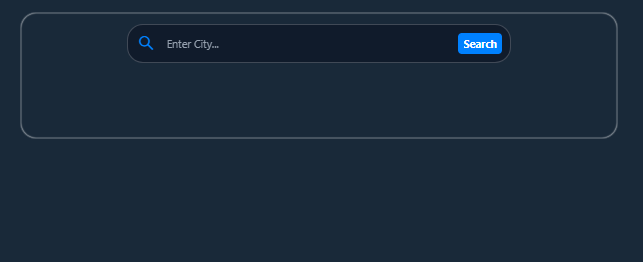
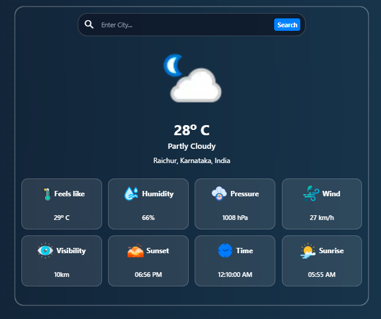
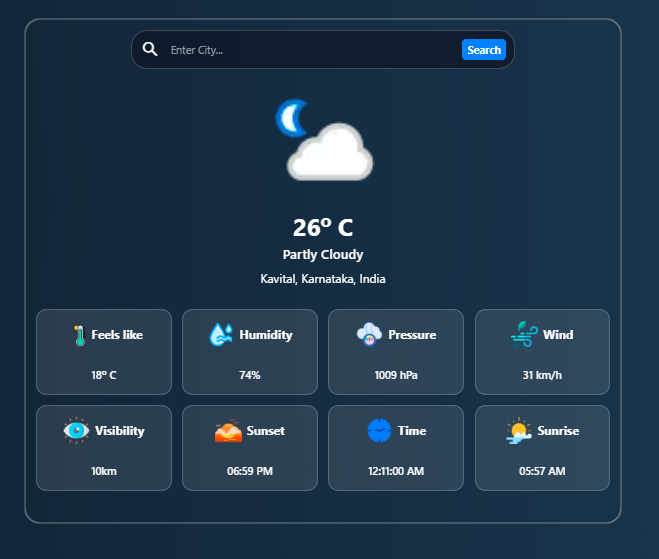
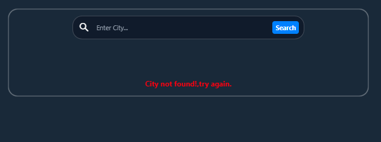

# 🌦️ Weather Dashboard

<p align="center">
  
</p>

<p align="center">
  <strong>A modern, responsive Weather Dashboard built with HTML, Tailwind CSS, and Vanilla JavaScript.</strong>
</p>

<p align="center">
  Real-time weather • Dynamic backgrounds • Glassmorphism UI • Responsive Design
</p>

---

## 📸 Preview

> Add screenshots after uploading them.

| Home | Weather | Night | Error |
|------|---------|-------|-------|
|  |  |  |  |

---

# ✨ Features

- 🔍 Search weather by city
- 🌡️ Current temperature
- 😊 Feels Like temperature
- 💧 Humidity
- 🌬️ Wind Speed
- 👁️ Visibility
- 🌅 Sunrise & Sunset
- 🕒 Local Time
- 📍 City, Region & Country
- 🎨 Dynamic weather-based backgrounds
- 🌙 Automatic Night Mode
- ⌛ Loading Animation
- ❌ Error Handling
- 📱 Fully Responsive Design

---

# 🚀 Live Link

> https://moyin-pasha-69.github.io/weather-dashboard/

---

# 🛠️ Tech Stack

| Technology | Usage |
|------------|-------|
| HTML5 | Structure |
| Tailwind CSS v4 | Styling |
| JavaScript (ES6+) | Functionality |
| WeatherAPI | Weather Data |
| Fetch API | API Requests |

---

# 📂 Folder Structure

```text
weather-dashboard/
│
├── assets/
│   ├── favicon/
│   │   └── favicon.png
│   │
│   ├── images/
│   │   ├── clock.png
│   │   ├── humidity.png
│   │   ├── pressure.png
│   │   ├── storm.png
│   │   ├── sunrise.png
│   │   ├── sunset.png
│   │   ├── temperature.png
│   │   └── visibility.png
│   │
│   └── preview/
│       ├── screenshot1.png
│       ├── screenshot2.png
│       ├── screenshot3.png
│       └── screenshot4.png
│
├── scripts/
│   └── script.js
│
├── src/
│   ├── input.css
│   ├── output.css
│   └── style.css
│
├── index.html
├── README.md
├── LICENSE
```

---

# ⚙️ How It Works

1. Enter a city name.
2. The application sends a request to the WeatherAPI.
3. The API returns live weather information.
4. JavaScript processes the JSON response.
5. The UI updates dynamically with:
   - Temperature
   - Weather condition
   - Humidity
   - Wind speed
   - Visibility
   - Sunrise & Sunset
   - Local Time
6. The background changes automatically based on the weather and time of day.

---

# 📚 What I Learned

Building this project helped me understand:

- REST APIs
- API Keys
- Query Parameters
- Fetch API
- Async / Await
- JSON Parsing
- Error Handling
- DOM Manipulation
- Dynamic Rendering
- Responsive UI Design
- Tailwind CSS Components
- Time Conversion Logic
- Code Organization
- Reusable Functions

---

# 💡 Challenges Faced

- Handling invalid city names
- Managing loading states
- Converting sunrise and sunset times
- Detecting night mode correctly
- Creating dynamic weather backgrounds
- Working with nested JSON data
- Designing a responsive glassmorphism UI

---

---

# 📷 Screenshots

### Home


---

### Weather Result


---

### Night Theme


---

### Error Handling


---

# 🤝 Contributing

Contributions, issues and feature requests are welcome.

Feel free to fork this repository and submit a pull request.

---

# ⭐ Show Your Support

If you found this project helpful, consider giving it a ⭐ on GitHub.

It motivates me to build more awesome projects.

---

# 👨‍💻 Author

## Moyin Pasha

** Frontend Developer**

Currently learning **Full Stack Development** by building real-world projects.

GitHub:
> https://github.com/moyin-pasha-69

LinkedIn:
> https://www.linkedin.com/in/moyin-pasha-7a68aa330/

---

## 📄 License

This project is licensed under the **MIT License**.

Feel free to use and modify it for learning purposes.
